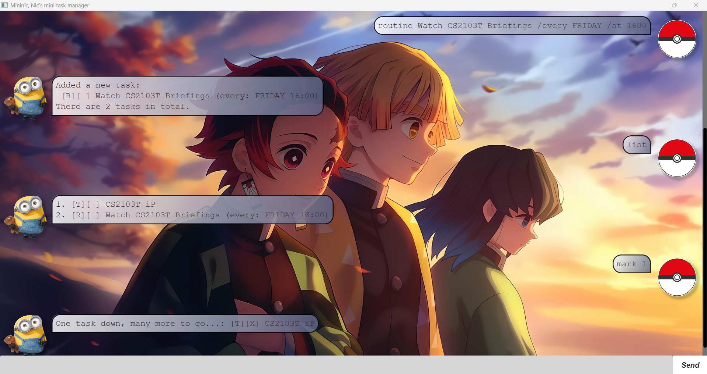
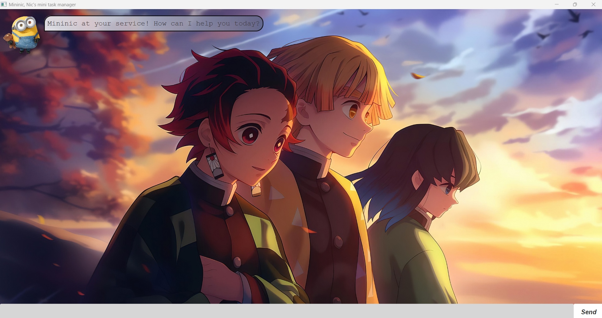

# Mininic User Guide

This project presents **Mininic**, a personal assistant chatbot built for *CS2103T iP*.

> Nic's personal task manager. **If you can type, you can fly.** It is optimised for use via a **Command Line Interface (CLI)** whilst preserving benefits of a Graphical User Interface (GUI). Fast typers can manage tasks much faster than traditional GUI apps.

## Quick Start:
1. Ensure you have Java 17 or above installed in your Computer.
Mac users: Ensure you have the precise JDK version prescribed **[here](https://se-education.org/guides/tutorials/javaInstallationMac.html)**.

2. Download the latest .jar file from **[here](https://github.com/nicholaslimzixian/ip)**.

3. Copy the file to the folder you want to use as the home folder for Mininic.

4. Open a command terminal, cd into the folder you put the jar file in, and use the java -jar Mininic.jar command to run the application.
5. A GUI similar to the one shown below should appear in a few seconds. 

## Features List:

### Todo Tasks: todo \<description>
Adds a "todo" task into the task list

Example: `todo CS2103T Quiz`

---

### Deadline Tasks: deadline \<description> \/by \<time>
Adds a "deadline" task into the task list. 
- /by must be present, to indicate the date to do the task by
- Enter the date in the format of yyyy-mm-dd

Example: `deadline CS2103T iP Project /by 2025-10-30`

---

### Event Tasks: event \<description> \/from \<start> \/to \<end>
Adds an "event" task into the task list. 
- /from and /to must be present, to indicate the event duration
- Enter the start and end date/time in the format of yyyy-mm-dd or yyyy-mm-dd HHmm

Example: `event CS2103T Opening Ceremony /from 2025-10-30 0900 /to 2025-10-30 1700`, `event CS2103T Closing Ceremony /from 2025-10-31 /to 2025-10-31`

---

### Routine Tasks: routine \<description> \/every \<day> \/at \<time>
Adds a "routine" task into the task list. 
- /every and /at must be present, to indicate when the task is repeated
- Enter the full name of the day (e.g. Monday/TUESDAY etc.), 
- Enter the time in 24hr clock format (e.g. 2:30PM should be entered as: 1430)

Example: `routine Watch CS2103T Briefing /every Friday /at 1600`

---

### List Tasks: list
Lists tasks saved into the hard drive

Example: `list`

---

### Mark/Unmark Tasks: mark/unmark \<N>
Mark/unmark tasks present in the tasklist

Example: `mark 1`
Example: `unmark 2`

---

### Delete Tasks: delete \<N>
Removes tasks present in the tasklist permanently

Example: `delete 1`

---

### Find Tasks: find \<keyword>
Searches for tasks in the tasklist that match the keyword specified

- The search is case insensitive
- Only the description of the task is searched
- Partial words will be matched (e.g. `books` will match `book`)

Example: `find CS2103T`

---

### Exit Application: bye
Exits the application

Example: `bye`

---

## Saving Data
Mininic remembers the tasks you've added/edited/removed previously. There is no need for manual saving.

## Editing Data
The data file Mininic uses can be found at `[JAR FILE LOCATION]/data/tasks.txt`. Users are welcomed to update data directly by editing that data file.
